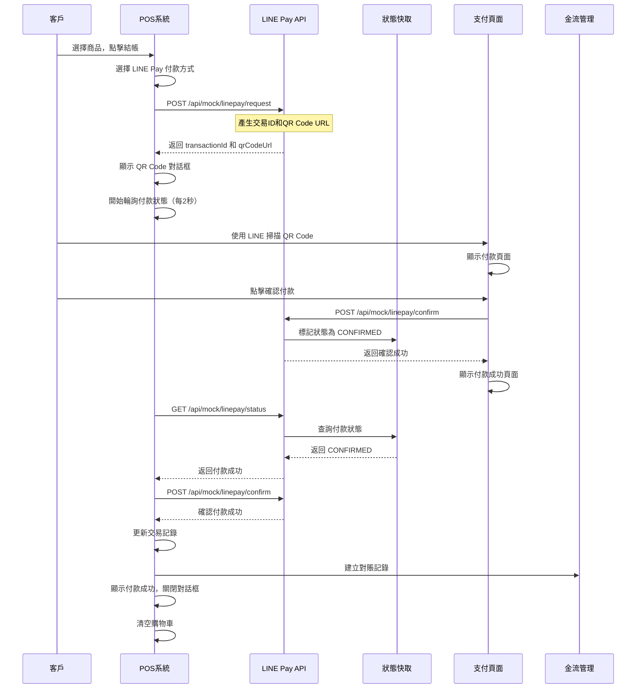

# LINE Pay 金流對接設計文件

> **文件版本**: v1.0  
> **建立日期**: 2025-01-XX  
> **最後更新**: 2025-01-XX  
> **用途**: LINE Pay 金流對接的完整設計文件，作為後臺實作依據和開發記錄

---

## 📋 目錄

1. [概述](#概述)
2. [系統架構](#系統架構)
3. [流程設計](#流程設計)
4. [API 設計](#api-設計)
5. [資料結構](#資料結構)
6. [前端實作](#前端實作)
7. [後端實作](#後端實作)
8. [狀態管理](#狀態管理)
9. [錯誤處理](#錯誤處理)
10. [測試流程](#測試流程)
11. [未來改進方向](#未來改進方向)

---

## 概述

### 功能目標

本文件描述 LINE Pay 金流對接的完整實作，包含：

- **QR Code 付款條碼產生**：POS 系統產生 LINE Pay 付款條碼
- **付款狀態輪詢**：自動檢查付款狀態
- **付款確認機制**：確認付款後建立對賬記錄
- **金流管理整合**：自動將付款記錄寫入金流管理系統

### 技術架構

- **前端框架**: Next.js 14 (App Router)
- **語言**: TypeScript
- **QR Code 產生**: qrcode.react
- **狀態管理**: React Hooks + localStorage
- **API 路由**: Next.js API Routes
- **快取機制**: 記憶體快取（Mock 模式）

### 適用場景

- **Mock 模式**：開發測試階段，使用假的 LINE Pay API
- **正式模式**：生產環境，對接真實的 LINE Pay API

---

## 系統架構

### 架構圖

```
┌─────────────────────────────────────────────────────────────┐
│                      POS 前端系統                              │
│  ┌──────────────┐  ┌──────────────┐  ┌──────────────┐       │
│  │  結帳頁面    │  │  QR Code     │  │  金流管理    │       │
│  │             │  │  顯示對話框  │  │  頁面        │       │
│  └──────┬───────┘  └──────┬───────┘  └──────┬───────┘       │
│         │                  │                  │               │
│         └──────────────────┼──────────────────┘               │
│                            │                                   │
│                   ┌────────▼────────┐                         │
│                   │  LinePayManager │                         │
│                   │   (工具類別)     │                         │
│                   └────────┬────────┘                         │
└────────────────────────────┼─────────────────────────────────┘
                             │
                             │ HTTP Request
                             │
┌────────────────────────────▼─────────────────────────────────┐
│                    Next.js API Routes                         │
│  ┌──────────────┐  ┌──────────────┐  ┌──────────────┐      │
│  │  /api/mock/  │  │  /api/mock/  │  │  /api/mock/  │      │
│  │  linepay/    │  │  linepay/    │  │  linepay/    │      │
│  │  request     │  │  confirm     │  │  status      │      │
│  └──────┬───────┘  └──────┬───────┘  └──────┬───────┘      │
│         │                  │                  │               │
│         └──────────────────┼──────────────────┘               │
│                            │                                   │
│                   ┌────────▼────────┐                         │
│                   │  linePayCache  │                         │
│                   │  (記憶體快取)   │                         │
│                   └─────────────────┘                         │
└───────────────────────────────────────────────────────────────┘
                             │
                             │ (未來)
                             │
┌────────────────────────────▼─────────────────────────────────┐
│                    LINE Pay API                                │
│  ┌──────────────┐  ┌──────────────┐  ┌──────────────┐      │
│  │  Request     │  │  Confirm     │  │  Status      │      │
│  │  Payment     │  │  Payment     │  │  Query       │      │
│  └──────────────┘  └──────────────┘  └──────────────┘      │
└───────────────────────────────────────────────────────────────┘
```

### 核心元件

1. **LinePayManager** (`lib/linepay-manager.ts`)
   - 統一管理 LINE Pay API 呼叫
   - 支援 Mock 和正式模式切換
   - 處理付款請求、確認、狀態查詢

2. **LINE Pay API Routes** (`app/api/mock/linepay/`)
   - `request/route.ts`: 付款請求 API
   - `confirm/route.ts`: 付款確認 API
   - `status/route.ts`: 付款狀態查詢 API

3. **狀態快取** (`lib/linepay-cache.ts`)
   - 記憶體快取付款狀態（Mock 模式）
   - 實際應使用 Redis 或資料庫

4. **POS 前端元件** (`app/dashboard/my-mobile-pos/page.tsx`)
   - 結帳流程整合
   - QR Code 顯示對話框
   - 付款狀態輪詢

5. **金流管理頁面** (`app/dashboard/my-mobile-pos/payment-flow/page.tsx`)
   - 顯示所有 LINE Pay 交易記錄
   - 對賬記錄管理

---

## 流程設計

### 完整付款流程



### 狀態轉換圖

```
[等待付款] ──輪詢──> [檢查狀態] ──成功──> [付款成功] ──> [建立對賬記錄]
   │                      │
   │                      └──失敗──> [付款失敗]
   │
   └──取消──> [取消付款]
```

### 關鍵狀態

1. **waiting**: 等待客戶掃描 QR Code
2. **checking**: 正在檢查付款狀態
3. **success**: 付款成功
4. **failed**: 付款失敗

---

## API 設計

### 1. 付款請求 API

**端點**: `POST /api/mock/linepay/request`

**請求格式**:
```typescript
{
  orderId: string;      // 訂單編號
  amount: number;       // 付款金額
  productName?: string; // 商品名稱（選填）
}
```

**回應格式**:
```typescript
{
  returnCode: '0000' | string;  // 返回碼，'0000' 表示成功
  returnMessage: string;        // 返回訊息
  info: {
    paymentUrl: {
      web: string;              // Web 支付 URL
      app: string;              // App 支付 URL
    };
    qrCodeUrl: string;          // QR Code URL（用於產生條碼）
    transactionId: string;      // 交易編號
    paymentAccessToken: string; // 付款存取 Token
  };
}
```

**實作位置**: `app/api/mock/linepay/request/route.ts`

### 2. 付款確認 API

**端點**: `POST /api/mock/linepay/confirm`

**請求格式**:
```typescript
{
  transactionId: string; // 交易編號
  orderId: string;       // 訂單編號
  amount: number;        // 付款金額
}
```

**回應格式**:
```typescript
{
  returnCode: '0000' | string;
  returnMessage: string;
  info: {
    orderId: string;
    transactionId: string;
    payStatus: 'CONFIRMED' | 'FAILED';
    payInfo: Array<{
      method: string;
      amount: number;
    }>;
  };
}
```

**實作位置**: `app/api/mock/linepay/confirm/route.ts`

**關鍵邏輯**:
- 標記付款狀態為 `CONFIRMED`
- 寫入狀態快取（實際應寫入資料庫）

### 3. 付款狀態查詢 API

**端點**: `GET /api/mock/linepay/status?transactionId=xxx&orderId=xxx`

**回應格式**:
```typescript
{
  returnCode: '0000' | string;
  returnMessage: string;
  info: {
    orderId: string;
    transactionId: string;
    payStatus: 'PENDING' | 'CONFIRMED' | 'FAILED' | 'CANCELLED';
    payInfo?: Array<{
      method: string;
      amount: number;
    }>;
  };
}
```

**實作位置**: `app/api/mock/linepay/status/route.ts`

**關鍵邏輯**:
- 從快取查詢付款狀態
- 返回當前狀態

---

## 資料結構

### 1. 交易記錄 (Transaction)

**位置**: `lib/indexeddb-pos.ts`

```typescript
interface Transaction {
  id?: number;
  transactionNumber: string;        // 交易編號
  items: CartItem[];                 // 交易商品
  subtotal: number;                  // 小計
  tax: number;                       // 稅額
  total: number;                     // 總額
  paymentMethod: 'cash' | 'linepay' | 'credit'; // 付款方式
  mobileCarrier?: string;            // 手機載具（選填）
  cashReceived?: number;             // 現金收款金額（現金付款）
  cashChange?: number;               // 找零（現金付款）
  createdAt: Date;                   // 建立時間
}
```

### 2. LINE Pay 對賬記錄

**位置**: `app/dashboard/my-mobile-pos/payment-flow/page.tsx`

```typescript
interface LinePayReconciliationRecord {
  id?: string;                       // 對賬記錄 ID
  transactionId: string;             // LINE Pay 交易編號
  orderId: string;                   // 訂單編號（POS 交易編號）
  amount: number;                    // 付款金額
  status: 'pending' | 'completed' | 'failed' | 'cancelled'; // 狀態
  paymentMethod: 'linepay' | 'cash' | 'credit'; // 付款方式
  createdAt: Date;                   // 建立時間
  confirmedAt?: Date;                 // 確認時間
  memo?: string;                     // 備註
}
```

### 3. LINE Pay 待處理記錄

**儲存位置**: `localStorage` (`pos_linepay_pending`)

```typescript
interface LinePayPendingRecord {
  transactionNumber: string;         // POS 交易編號
  transactionId: string;            // LINE Pay 交易編號
  amount: number;                    // 付款金額
  createdAt: string;                // ISO 日期字串
  confirmed?: boolean;               // 是否已確認
  confirmedAt?: string;             // 確認時間（ISO 字串）
}
```

### 4. 狀態快取

**位置**: `lib/linepay-cache.ts`

```typescript
// 記憶體快取結構
Map<string, 'PENDING' | 'CONFIRMED' | 'FAILED' | 'CANCELLED'>

// Key: transactionId
// Value: 付款狀態
```

---

## 前端實作

### 1. LinePayManager 工具類別

**位置**: `lib/linepay-manager.ts`

**主要方法**:

```typescript
class LinePayManager {
  // 請求付款
  async requestPayment(
    orderId: string,
    amount: number,
    productName?: string
  ): Promise<LinePayRequestResponse>

  // 確認付款
  async confirmPayment(
    transactionId: string,
    orderId: string,
    amount: number
  ): Promise<LinePayConfirmResponse>

  // 查詢付款狀態
  async checkPaymentStatus(
    transactionId: string,
    orderId: string
  ): Promise<LinePayStatusResponse>
}
```

**關鍵特性**:
- 支援 Mock 和正式模式切換（透過環境變數 `NEXT_PUBLIC_USE_MOCK_PAYMENT`）
- 統一的錯誤處理
- 型別安全的介面

### 2. POS 結帳流程整合

**位置**: `app/dashboard/my-mobile-pos/page.tsx`

**關鍵狀態**:
```typescript
const [isLinePayQROpen, setIsLinePayQROpen] = useState(false);
const [linePayQRUrl, setLinePayQRUrl] = useState('');
const [linePayTransactionId, setLinePayTransactionId] = useState('');
const [linePayOrderId, setLinePayOrderId] = useState('');
const [linePayAmount, setLinePayAmount] = useState(0);
const [linePayStatus, setLinePayStatus] = useState<'waiting' | 'checking' | 'success' | 'failed'>('waiting');
const linePayPollIntervalRef = useRef<NodeJS.Timeout | null>(null);
```

**關鍵函數**:

1. **handleCheckout**: 處理結帳邏輯
   - 判斷付款方式
   - 如果是 LINE Pay，呼叫 `requestPayment`
   - 顯示 QR Code 對話框
   - 開始輪詢付款狀態

2. **startLinePayPolling**: 開始輪詢付款狀態
   - 每 2 秒檢查一次付款狀態
   - 付款成功後自動確認
   - 建立對賬記錄
   - 更新交易狀態

3. **handleLinePayClose**: 關閉 QR Code 對話框
   - 清除輪詢
   - 清空購物車
   - 重置表單

### 3. QR Code 顯示對話框

**位置**: `app/dashboard/my-mobile-pos/page.tsx` (Dialog 元件)

**顯示內容**:
- 訂單編號
- 交易編號
- 付款金額
- QR Code（使用 `QRCodeSVG` 元件）
- 付款狀態指示器

**狀態顯示**:
- **waiting**: 顯示 QR Code，提示等待掃描
- **checking**: 顯示 QR Code，顯示「正在確認付款...」
- **success**: 顯示成功圖示和訊息
- **failed**: 顯示失敗圖示和訊息

### 4. 金流管理頁面

**位置**: `app/dashboard/my-mobile-pos/payment-flow/page.tsx`

**功能**:
- 顯示所有交易記錄
- 從交易記錄建立 LINE Pay 對賬記錄
- 管理對賬記錄狀態
- 查看交易詳情
- 建立測試資料

---

## 後端實作

### 1. 付款請求 API

**位置**: `app/api/mock/linepay/request/route.ts`

**實作邏輯**:
```typescript
export async function POST(req: NextRequest) {
  // 1. 解析請求參數
  const { orderId, amount, productName } = await req.json();

  // 2. 驗證參數
  if (!orderId || !amount) {
    return NextResponse.json({ error: '缺少必要參數' }, { status: 400 });
  }

  // 3. 模擬延遲（讓它看起來真實）
  await new Promise(resolve => setTimeout(resolve, 500));

  // 4. 產生交易 ID 和 QR Code URL
  const transactionId = `MOCK${Date.now()}${randomString}`;
  const qrCodeUrl = `${BASE_URL}/mock/linepay/payment?transactionId=${transactionId}&orderId=${orderId}&amount=${amount}`;

  // 5. 返回回應
  return NextResponse.json({
    returnCode: '0000',
    returnMessage: 'Success',
    info: {
      paymentUrl: { web: qrCodeUrl, app: `line://pay/payment/${transactionId}` },
      qrCodeUrl,
      transactionId,
      paymentAccessToken: `mock_token_${uuid}`,
    },
  });
}
```

### 2. 付款確認 API

**位置**: `app/api/mock/linepay/confirm/route.ts`

**實作邏輯**:
```typescript
export async function POST(req: NextRequest) {
  // 1. 解析請求參數
  const { transactionId, orderId, amount } = await req.json();

  // 2. 驗證參數
  if (!transactionId || !orderId) {
    return NextResponse.json({ error: '缺少必要參數' }, { status: 400 });
  }

  // 3. 模擬處理時間
  await new Promise(resolve => setTimeout(resolve, 800));

  // 4. 標記為已確認（寫入快取）
  linePayCache.setStatus(transactionId, 'CONFIRMED');

  // 5. 返回確認成功
  return NextResponse.json({
    returnCode: '0000',
    returnMessage: 'Success',
    info: {
      orderId,
      transactionId,
      payStatus: 'CONFIRMED',
      payInfo: [{ method: 'BALANCE', amount }],
    },
  });
}
```

### 3. 付款狀態查詢 API

**位置**: `app/api/mock/linepay/status/route.ts`

**實作邏輯**:
```typescript
export async function GET(req: NextRequest) {
  // 1. 取得查詢參數
  const transactionId = searchParams.get('transactionId');
  const orderId = searchParams.get('orderId');

  // 2. 驗證參數
  if (!transactionId || !orderId) {
    return NextResponse.json({ error: '缺少必要參數' }, { status: 400 });
  }

  // 3. 模擬查詢延遲
  await new Promise(resolve => setTimeout(resolve, 300));

  // 4. 從快取查詢狀態
  const status = linePayCache.getStatus(transactionId);
  const isConfirmed = status === 'CONFIRMED';

  // 5. 返回狀態
  if (isConfirmed) {
    return NextResponse.json({
      returnCode: '0000',
      returnMessage: 'Success',
      info: {
        orderId,
        transactionId,
        payStatus: 'CONFIRMED',
        payInfo: [{ method: 'BALANCE', amount: 1000 }],
      },
    });
  }

  // 預設為待處理
  return NextResponse.json({
    returnCode: '0000',
    returnMessage: 'Pending',
    info: {
      orderId,
      transactionId,
      payStatus: 'PENDING',
    },
  });
}
```

### 4. 狀態快取實作

**位置**: `lib/linepay-cache.ts`

**實作邏輯**:
```typescript
const paymentStatusCache = new Map<string, PaymentStatus>();

export const linePayCache = {
  setStatus(transactionId: string, status: PaymentStatus) {
    paymentStatusCache.set(transactionId, status);
  },

  getStatus(transactionId: string): PaymentStatus | null {
    return paymentStatusCache.get(transactionId) || null;
  },

  clearStatus(transactionId: string) {
    paymentStatusCache.delete(transactionId);
  },
};
```

**注意事項**:
- 這是記憶體快取，重啟服務會清空
- 實際應使用 Redis 或資料庫
- 需要考慮快取過期時間

---

## 狀態管理

### 前端狀態流程

```
1. 用戶選擇 LINE Pay
   ↓
2. 呼叫 requestPayment API
   ↓
3. 收到 transactionId 和 qrCodeUrl
   ↓
4. 設定狀態：waiting
   ↓
5. 顯示 QR Code 對話框
   ↓
6. 開始輪詢（每 2 秒）
   ↓
7. 輪詢中：checking
   ↓
8. 付款成功：success → 確認付款 → 建立對賬記錄
   ↓
9. 付款失敗：failed
```

### 後端狀態流程

```
1. 建立交易（request API）
   ↓
2. 狀態：PENDING（預設）
   ↓
3. 用戶在支付頁面確認付款
   ↓
4. 呼叫 confirm API
   ↓
5. 狀態：CONFIRMED（寫入快取）
   ↓
6. 前端輪詢 status API
   ↓
7. 返回 CONFIRMED 狀態
```

---

## 錯誤處理

### 前端錯誤處理

1. **API 請求失敗**
   - 顯示錯誤 Toast
   - 記錄錯誤日誌
   - 允許用戶重試

2. **付款超時**
   - 輪詢超過一定時間（建議 5 分鐘）
   - 自動停止輪詢
   - 提示用戶檢查付款狀態

3. **付款失敗**
   - 顯示失敗訊息
   - 允許用戶重新付款
   - 保留交易記錄

### 後端錯誤處理

1. **參數驗證**
   - 檢查必要參數
   - 返回明確的錯誤訊息

2. **系統錯誤**
   - 記錄錯誤日誌
   - 返回統一的錯誤格式

3. **狀態不一致**
   - 檢查交易狀態
   - 防止重複確認

---

## 測試流程

### 1. 單元測試

**測試項目**:
- LinePayManager 的方法
- API 路由的參數驗證
- 狀態快取的讀寫

### 2. 整合測試

**測試流程**:
1. 建立測試交易
2. 請求付款
3. 模擬付款確認
4. 驗證對賬記錄建立

### 3. 端對端測試

**測試場景**:
1. **正常流程**
   - 選擇 LINE Pay → 顯示 QR Code → 掃描付款 → 確認成功

2. **付款失敗**
   - 選擇 LINE Pay → 顯示 QR Code → 付款失敗 → 顯示錯誤

3. **付款超時**
   - 選擇 LINE Pay → 顯示 QR Code → 等待超時 → 提示檢查

4. **取消付款**
   - 選擇 LINE Pay → 顯示 QR Code → 取消 → 關閉對話框

### 4. 手動測試步驟

1. 前往「我的行動POS」頁面
2. 掃描商品加入購物車
3. 點擊「結帳」
4. 選擇「LINE Pay」
5. 點擊「確認結帳」
6. 確認 QR Code 顯示
7. 開啟新視窗訪問支付頁面（或直接模擬付款）
8. 在支付頁面點擊「確認付款」
9. 觀察 POS 系統自動偵測付款成功
10. 前往「金流管理」頁面查看對賬記錄

---

## 未來改進方向

### V1 改進（短期）

1. **資料庫整合**
   - 將狀態快取改為資料庫儲存
   - 建立 `linepay_transactions` 表
   - 記錄完整的交易歷史

2. **Redis 快取**
   - 使用 Redis 取代記憶體快取
   - 設定快取過期時間
   - 支援分散式部署

3. **Webhook 支援**
   - 實作 LINE Pay Webhook 接收
   - 自動更新付款狀態
   - 減少輪詢頻率

4. **錯誤重試機制**
   - 實作指數退避重試
   - 記錄重試次數
   - 超過重試次數後標記失敗

### V2 改進（中期）

1. **對接真實 LINE Pay API**
   - 實作 LINE Pay 官方 API
   - 處理簽章驗證
   - 實作完整的錯誤處理

2. **多付款方式支援**
   - 支援其他付款方式（信用卡、現金等）
   - 統一的付款介面
   - 付款方式切換

3. **對賬自動化**
   - 自動對賬功能
   - 差異檢測
   - 異常告警

4. **報表功能**
   - 付款統計報表
   - 交易分析
   - 對賬報表

### V3 改進（長期）

1. **即時通知**
   - WebSocket 即時通知
   - 付款成功即時推送
   - 減少輪詢

2. **批次處理**
   - 批次對賬
   - 批次確認
   - 提升效能

3. **安全性增強**
   - 實作交易簽章
   - 防止重複付款
   - 交易加密

4. **監控和日誌**
   - 完整的交易日誌
   - 效能監控
   - 錯誤追蹤

---

## 程式碼結構

### 檔案清單

```
app/
├── api/
│   └── mock/
│       └── linepay/
│           ├── request/
│           │   └── route.ts          # 付款請求 API
│           ├── confirm/
│           │   └── route.ts          # 付款確認 API
│           └── status/
│               └── route.ts          # 付款狀態查詢 API
├── dashboard/
│   └── my-mobile-pos/
│       ├── page.tsx                  # POS 主頁面（含 QR Code 對話框）
│       └── payment-flow/
│           └── page.tsx              # 金流管理頁面
├── mock/
│   └── linepay/
│       └── payment/
│           └── page.tsx              # 模擬支付頁面
└── payment/
    ├── confirm/
    │   └── page.tsx                  # 付款確認頁面
    └── cancel/
        └── page.tsx                  # 付款取消頁面

lib/
├── linepay-manager.ts                # LINE Pay 管理工具類別
└── linepay-cache.ts                  # 狀態快取（記憶體）
```

### 關鍵程式碼片段

#### 1. 付款請求流程

```typescript
// app/dashboard/my-mobile-pos/page.tsx

if (paymentMethod === 'linepay') {
  // 1. 請求付款
  const linePayResponse = await linePayManager.requestPayment(
    transactionNumber,
    total,
    productName
  );

  // 2. 設定 QR Code 資訊
  setLinePayQRUrl(linePayResponse.qrCodeUrl);
  setLinePayTransactionId(linePayResponse.transactionId);
  setLinePayOrderId(transactionNumber);
  setLinePayAmount(total);
  setLinePayStatus('waiting');

  // 3. 建立交易記錄
  await posDB.createTransaction(transaction);

  // 4. 顯示 QR Code 對話框
  setIsLinePayQROpen(true);

  // 5. 開始輪詢付款狀態
  startLinePayPolling(linePayResponse.transactionId, transactionNumber);
}
```

#### 2. 輪詢機制

```typescript
// app/dashboard/my-mobile-pos/page.tsx

const startLinePayPolling = (transactionId: string, orderId: string) => {
  linePayPollIntervalRef.current = setInterval(async () => {
    // 1. 查詢付款狀態
    const statusResponse = await linePayManager.checkPaymentStatus(
      transactionId,
      orderId
    );

    // 2. 如果付款成功
    if (statusResponse.success && statusResponse.status === 'CONFIRMED') {
      // 3. 確認付款
      const confirmResponse = await linePayManager.confirmPayment(
        transactionId,
        orderId,
        linePayAmount
      );

      // 4. 建立對賬記錄
      const reconciliationRecord = {
        id: `LP${Date.now()}`,
        transactionId,
        orderId,
        amount: linePayAmount,
        status: 'completed',
        paymentMethod: 'linepay',
        createdAt: new Date().toISOString(),
        confirmedAt: new Date().toISOString(),
      };
      // 儲存到 localStorage
      // ...

      // 5. 停止輪詢
      clearInterval(linePayPollIntervalRef.current);
    }
  }, 2000); // 每 2 秒檢查一次
};
```

#### 3. QR Code 顯示

```typescript
// app/dashboard/my-mobile-pos/page.tsx

<Dialog open={isLinePayQROpen}>
  <DialogContent>
    {/* 付款資訊 */}
    <div>
      <p>訂單編號: {linePayOrderId}</p>
      <p>交易編號: {linePayTransactionId}</p>
      <p>付款金額: NT$ {linePayAmount}</p>
    </div>

    {/* QR Code */}
    {linePayStatus === 'waiting' && (
      <QRCodeSVG value={linePayQRUrl} size={256} />
    )}

    {/* 狀態指示器 */}
    {linePayStatus === 'checking' && (
      <Loader2 className="animate-spin" />
    )}

    {linePayStatus === 'success' && (
      <CheckCircle2 className="text-green-500" />
    )}
  </DialogContent>
</Dialog>
```

---

## 環境變數設定

### 開發環境

```env
# .env.local
NEXT_PUBLIC_USE_MOCK_PAYMENT=true
NEXT_PUBLIC_APP_URL=http://localhost:3000
```

### 生產環境

```env
# .env.production
NEXT_PUBLIC_USE_MOCK_PAYMENT=false
NEXT_PUBLIC_APP_URL=https://your-domain.com

# LINE Pay 正式 API 設定
LINE_PAY_CHANNEL_ID=your_channel_id
LINE_PAY_CHANNEL_SECRET=your_channel_secret
LINE_PAY_SANDBOX=false
```

---

## 注意事項

### 1. 安全性

- **交易簽章**: 實際對接時需要實作交易簽章驗證
- **HTTPS**: 生產環境必須使用 HTTPS
- **Token 管理**: 妥善保管 LINE Pay API Token
- **重複付款防護**: 檢查交易是否已確認

### 2. 效能

- **輪詢頻率**: 建議 2-3 秒，避免過於頻繁
- **快取策略**: 使用 Redis 快取狀態，減少資料庫查詢
- **批次處理**: 大量交易時考慮批次處理

### 3. 可靠性

- **錯誤重試**: 實作錯誤重試機制
- **交易記錄**: 完整記錄所有交易狀態變更
- **對賬機制**: 定期對賬，確保資料一致性

### 4. 擴展性

- **分散式部署**: 狀態快取應使用 Redis 等分散式快取
- **水平擴展**: API 應設計為無狀態，支援水平擴展
- **訊息佇列**: 大量交易時考慮使用訊息佇列

---

## 參考資料

### LINE Pay 官方文件

- [LINE Pay API 文件](https://pay.line.me/documents/online_v3_zh_TW.html)
- [LINE Pay 開發者指南](https://pay.line.me/documents/developers.html)

### 相關文件

- `NetSuite中臺建置完全指南.md` - 專案整體架構
- `DEPLOYMENT.md` - 部署說明
- `TROUBLESHOOTING.md` - 問題排查指南

---

## 版本歷史

### v1.0 (2025-01-XX)

- 初始版本
- 實作 Mock 模式的 LINE Pay 對接
- QR Code 付款條碼產生
- 付款狀態輪詢機制
- 金流管理整合

---

**文件維護**: 此文件應隨系統發展持續更新，反映最新的實作細節和改進方向。

